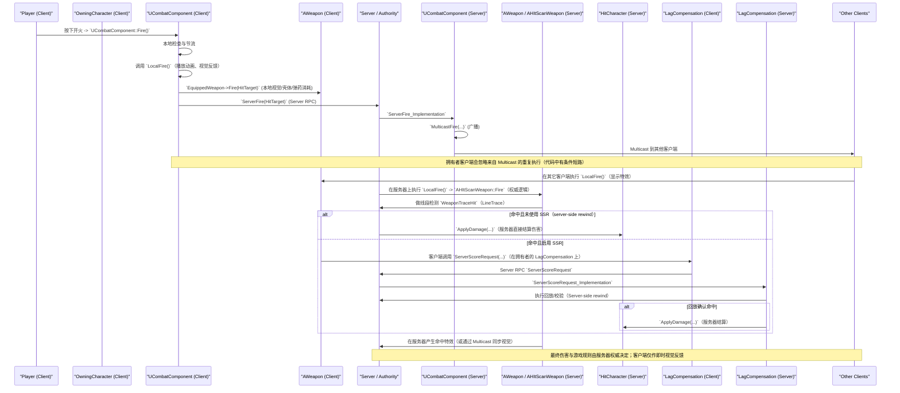

```mermaid
sequenceDiagram
    participant Player as "Player (Client)"
    participant OwningChar as "OwningCharacter (Client)"
    participant OwningCombat as "UCombatComponent (Client)"
    participant OwningWeapon as "AWeapon (Client)"
    participant Server as "Server / Authority"
    participant ServerCombat as "UCombatComponent (Server)"
    participant ServerWeapon as "AWeapon / AHItScanWeapon (Server)"
    participant HitChar as "HitCharacter (Server)"
    participant LC_Client as "LagCompensation (Client)"
    participant LC_Server as "LagCompensation (Server)"
    participant Others as "Other Clients"

    Player ->> OwningCombat: 按下开火 -> `UCombatComponent::Fire()`
    OwningCombat ->> OwningCombat: 本地检查与节流
    OwningCombat ->> OwningCombat: 调用 `LocalFire()`（播放动画、视觉反馈）
    OwningCombat ->> OwningWeapon: `EquippedWeapon->Fire(HitTarget)` (本地视觉/壳体/弹药消耗)
    OwningCombat ->> Server: `ServerFire(HitTarget)` (Server RPC)

    Server ->> ServerCombat: `ServerFire_Implementation`
    ServerCombat ->> ServerCombat: `MulticastFire(...)` (广播)
    ServerCombat ->> Others: Multicast 到其他客户端
    note over OwningCombat,Others: 拥有者客户端会忽略来自 Multicast 的重复执行（代码中有条件短路）

    Others ->> OwningWeapon: 在其它客户端执行 `LocalFire()`（显示特效）
    Server ->> ServerWeapon: 在服务器上执行 `LocalFire()` -> `AHItScanWeapon::Fire`（权威逻辑）
    ServerWeapon ->> Server: 做线段检测 `WeaponTraceHit`（LineTrace）
    alt 命中且未使用 SSR（server-side rewind）
        Server ->> HitChar: `ApplyDamage(...)`（服务器直接结算伤害）
    else 命中且启用 SSR
        %% 客户端已向服务器发送延迟补偿请求
        OwningWeapon ->> LC_Client: 客户端调用 `ServerScoreRequest(...)`（在拥有者的 LagCompensation 上）
        LC_Client ->> Server: Server RPC `ServerScoreRequest`
        Server ->> LC_Server: `ServerScoreRequest_Implementation`
        LC_Server ->> Server: 执行回放/校验（Server-side rewind）
        alt 回放确认命中
            LC_Server ->> HitChar: `ApplyDamage(...)`（服务器结算）
        end
    end

    ServerWeapon ->> Server: 在服务器产生命中特效（或通过 Multicast 同步视觉）
    note over Server,Others: 最终伤害与游戏规则由服务器权威决定；客户端仅作即时视觉反馈
```